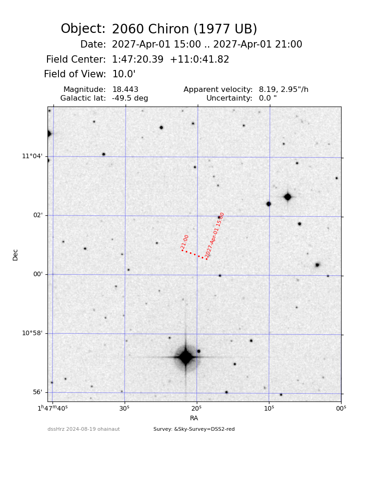

# dssHrz
For a solar system object and a period of time, get the object's ephemerides from  JPL Horizon, and generate a DSS finding chart for each night

It uses astroquery.jplhorizons to get the ephemerides from JPL, and retreives the DSS from the ESO archive.

```
Usage: dssHrz.py [-h] [-f OUTFILE] [-o OBJECT] [-n NIGHT] [-e ENDNIGHT] [-t TEL] [--FoV FOV]
                 [-p ESOPROGID] [-s SURVEY]

Generate a DSS finding chart for a solar system object for 1 night

options:
  -h, --help            show this help message and exit
  -f OUTFILE, --outFile OUTFILE
                        Root of the output files. Default is DSS
  -o OBJECT, --object OBJECT
                        Designation of the object; must be resolved by Horizon; in case of doubt use the Unique JPL ID (in the ephem header, 1st line Rec #:
  -n NIGHT, --night NIGHT
                        Night to be considered: YYYY-MM-DD[Thh:mm]; the ephem will go from t0 to t0+24h
  -e ENDNIGHT, --endNight ENDNIGHT
                        If provided, will iterate from night to endNight
  -t TEL, --tel TEL     IAU Observatory code or name, must be resolved by JPL.
                        Default is 309 = Paranal.
  --FoV FOV             Field of view, arcmin; will be extended if needed
  -p ESOPROGID, --ESOprogId ESOPROGID
                        ESO program ID for labeling ESO-SM finders.
  -s SURVEY, --survey SURVEY
                        survey, from DSS2-red DSS2-blue DSS1 or any.
                        Default is any, which will try all 3 in that order.
```


If more than 1 night is requested, the script will iterate and produce one finder per night.

The plot has 1 point per hour; if the orbital uncertainty is larger than 5", the uncertainty ellipse is drawn in a corner.

Example:


